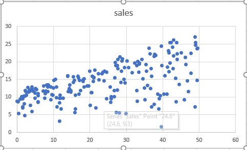
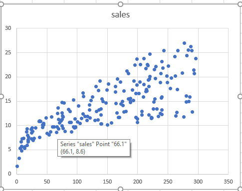
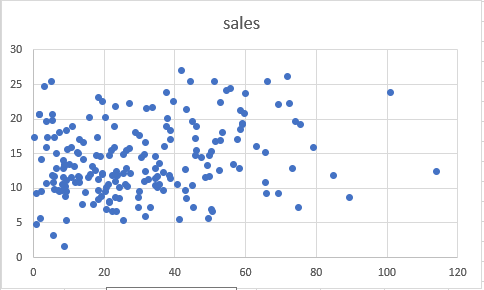

Title: ExcelでLinear Regressionを調査します 
Slug: excel-linear-regression
Date: 2017-10-11 00:35:46
Modified: 2017-10-11 00:35:46
Tags: 
Category: 
Author: 
Lang: jp
Summary:

### Dataset

私たちは統計コンサルタントとしてクライアントは、特定の製品の販売を改善する方法に関してアドバイスを提供します。
報告データセットは２００の市場でその製品の販売と３つのメディアにおける製品の報告予算で構成されています。

| TV            | Radio         | Newpaper    |Sales|
| ------------- |---------------|-------------|-----|
| 230.1         | 37.8          | 69.2        |22.1 |
| 44.5          | 39.3          | 45.1        |10.4 |
| ...           | ...           | ...         | ... |
| 180           | 10.8          | 58.4        |12.9 |

### Scatter plotでデータを分析します。

TV

radio

newspaper

３つのグラプを見ると、TVとラジオとnewspaperは傾向を簡単に見えるです。Linear regressionを使ってデータの傾向をキャップチャーできる事を期待できます。



Correlation Matrix

> Correlation coefficients　の範囲は−１から１までです。ある値が増加すると、他の値も向上します。Correlation coefficients は　＞　0.

### Estimate parameters

> Linear Regressionのゴールはい一番いいな傾向のラインを派生する為です。このラインは、予測誤差をできるだけ減らすように配置されています。

先に分析した結果に基づいて、SalesとTV、ラジオ、newspaperは線形関係がある事を前提として、数学的に、以下のモデルを作成できます。

$$
sales \approx \beta_0 + \beta_1 \times TV + \beta_2 \times radio + \beta_3 \times newspaper
$$

このモデルは３つのプレディクタがあります。
* TV
* radio
* newspaper

予測誤差を減らす為、　$\beta_0$,  $\beta_1$, $\beta_2$, $\beta_3$　四つのパラメータを探します。

四つのパラメータの場合、グラフで誤差をあらわせられないですが、

以下のグラフは2Dの誤差を表せます。



以下のグラフは3Dの誤差を表せます。



モデルを予測結果は平面で、実際のデータは赤いドットで表せられます。誤差は赤いドットと平面の距離です。誤差を減らす為、適当なパラメータを探して、平面はドットを近くほど、予測精度は向上します。

このモデルを使って、未来のSalesを予測できます。
$$
\hat{Y} = \beta_0 + \beta_1 \times TV + \beta_2 \times radio + \beta_3 \times newspaper
$$ 

パラメータを探すは難しいですが、Excelで簡単に計算できます。
以下の結果をもらえます。



結果のインタプレスタ：

- TV,とnewspaperを固定して、さらに１０００ドルをラジロ報告を費やすと、販売個数は約190個を増加する。
- newspaperの場合は$\beta_4$はゼロに近い、p-valueは0.86、newspaperとsalesは関係ない事を通じわけではない。correlation matrixを見ると、newspaperとradioのcorrelation値は0.35。これは、ラジオ広告にもっと費やされる市場での新聞広告にもっと費やす傾向があることを示しています。
-  ここで、Linear Regressionは正しいとし、newspaper広告は売上に直接影響を与えないが、ラジオ広告は売上を増加させると仮定する。 そして、ラジオにもっと費やす市場では、売上高は高くなる傾向があり、correlation matrixが示すように、同じ市場でのnewspaper広告にもっと費やす傾向があります

